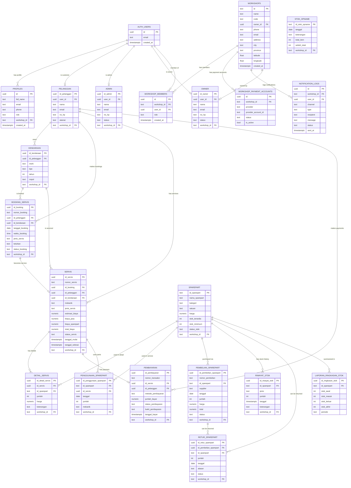
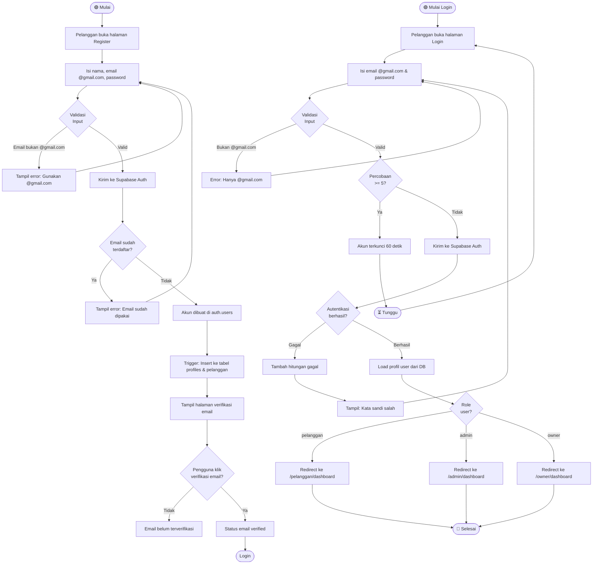
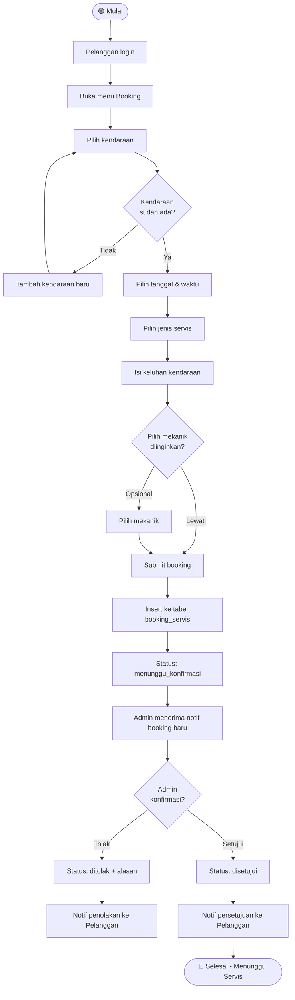
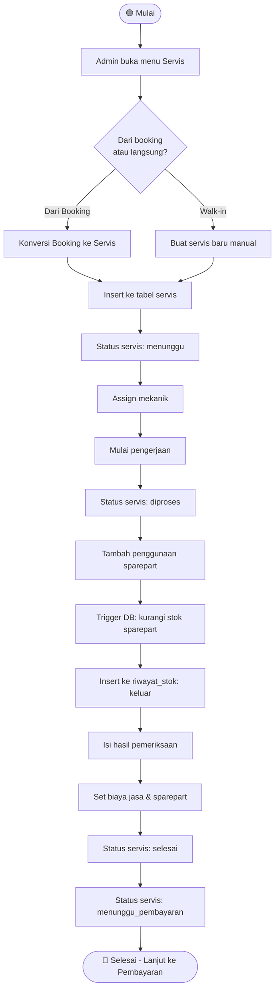
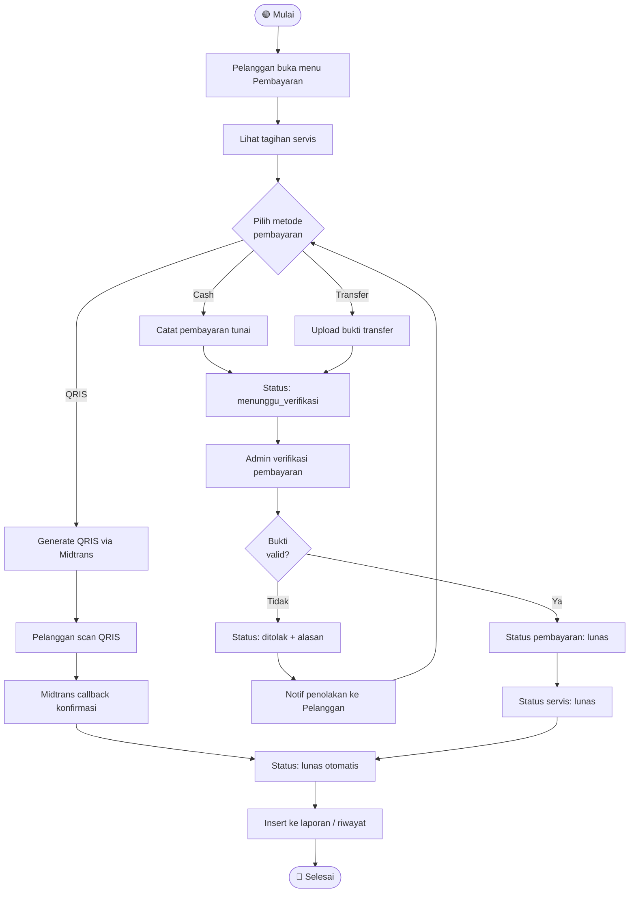
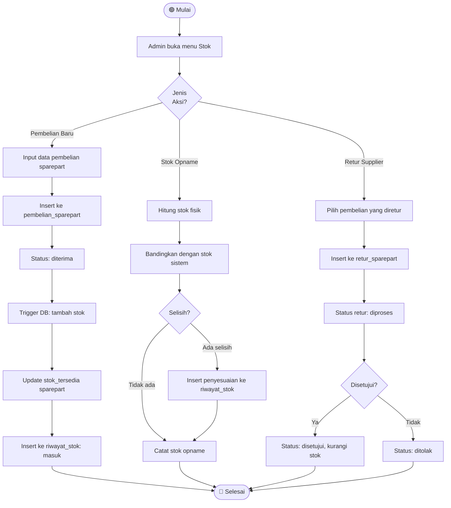
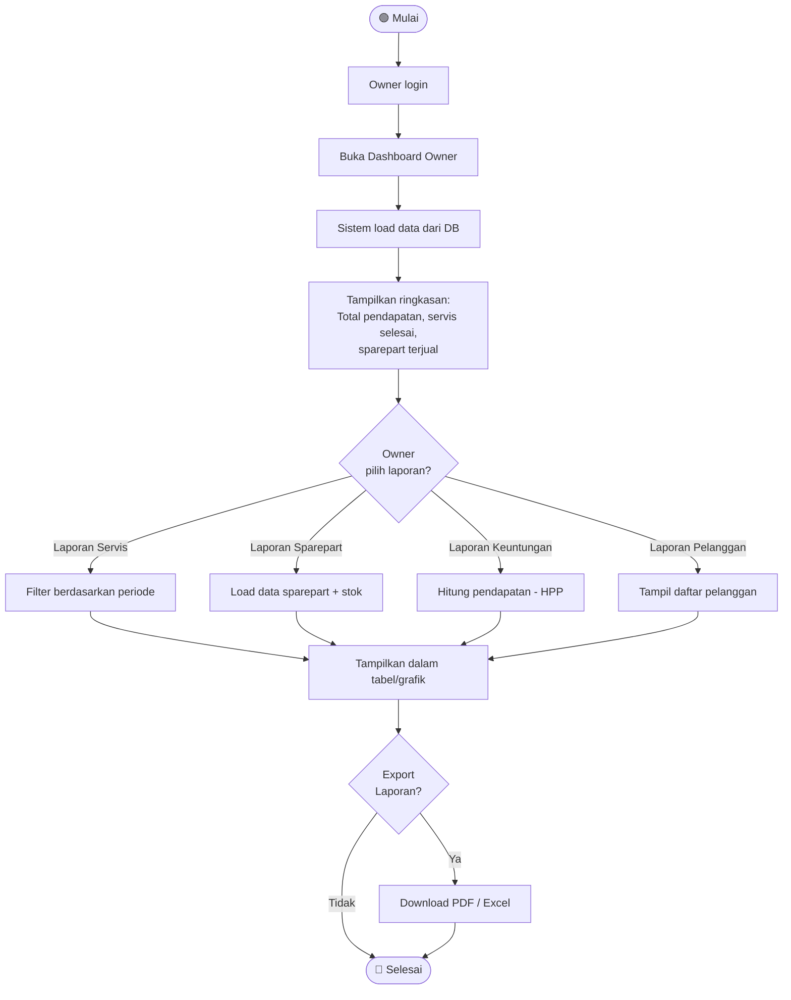

# 📊 AppBenk — ERD & BPMN Diagram

---

## 🗃️ ERD (Entity Relationship Diagram)

> Menggambarkan seluruh tabel database AppBenk beserta relasinya.



---

## 🔄 BPMN — Proses Utama AppBenk

### 1. BPMN: Registrasi & Login Pelanggan



---

### 2. BPMN: Lupa Password (OTP Flow)

```mermaid
flowchart TD
    A([🟢 Mulai]) --> B[Pelanggan klik Lupa Password]
    B --> C{Email sudah\ndiisi di form?}
    C -- Tidak --> D[Tampil pesan: Isi email dulu]
    D --> B
    C -- Ya --> E{Email\n@gmail.com?}
    E -- Tidak --> F[Error: Hanya @gmail.com]
    F --> B
    E -- Ya --> G[Kirim OTP ke email via Supabase]
    G --> H[Redirect ke halaman /reset-password]
    H --> I[Pelanggan buka email]
    I --> J[Salin kode OTP 6 digit]
    J --> K[Masukkan email, OTP, dan password baru]
    K --> L{Validasi\nOTP}
    L -- OTP salah / expired --> M[Tampil error verifikasi gagal]
    M --> K
    L -- OTP valid --> N[supabase.auth.verifyOtp]
    N --> O[supabase.auth.updateUser - password baru]
    O --> P[Redirect ke halaman Login]
    P --> Q([🔴 Selesai])
```

---

### 3. BPMN: Booking Servis oleh Pelanggan



---

### 4. BPMN: Proses Servis oleh Admin/Mekanik



---

### 5. BPMN: Proses Pembayaran



---

### 6. BPMN: Manajemen Stok Sparepart



---

### 7. BPMN: Laporan & Dashboard Owner



---

## 📋 Ringkasan Entitas & Peran

| Tabel | Deskripsi | Aktor |
|---|---|---|
| `auth.users` | Tabel bawaan Supabase Auth | Sistem |
| `profiles` | Profil publik user, bridge Auth ↔ App | Semua |
| `workshops` | Entitas bengkel (multi-tenant) | Owner, Sistem |
| `workshop_members` | RBAC: Anggota & role per bengkel | Sistem |
| `pelanggan` | Data pelanggan terdaftar | Pelanggan |
| `kendaraan` | Kendaraan milik pelanggan | Pelanggan |
| `booking_servis` | Permintaan booking servis | Pelanggan → Admin |
| `servis` | Catatan pengerjaan servis aktual | Admin, Mekanik |
| `detail_servis` | Detail sparepart per servis | Admin |
| `pembayaran` | Transaksi pembayaran servis | Pelanggan → Admin |
| `sparepart` | Katalog & stok sparepart | Admin |
| `penggunaan_sparepart` | Log pemakaian sparepart per servis | Admin |
| `pembelian_sparepart` | Pembelian dari supplier | Admin |
| `riwayat_stok` | Log pergerakan stok (masuk/keluar) | Sistem (Trigger) |
| `stok_opname` | Rekap opname stok berkala | Admin |
| `retur_sparepart` | Pengembalian barang ke supplier | Admin |
| `laporan_ringkasan_stok` | Laporan stok per periode | Owner, Admin |
| `notification_logs` | Log notif Email/WA/In-App | Sistem |
| `admin` | Data admin bengkel | Owner |
| `owner` | Data owner bengkel | Sistem |
