# 🗃️ AppBenk — Entity Relationship Diagram (ERD) Terbaru

> **Versi:** September 2026  
> **Database:** PostgreSQL via Supabase  
> **Arsitektur:** Multi-Tenant SaaS (Multi-Bengkel)  
> **Total Entitas:** 22 Tabel

---

## 📌 Diagram ERD

```mermaid
erDiagram

    AUTH_USERS {
        uuid     id              PK
        text     email           UK
        text     encrypted_password
        text     role
        jsonb    raw_user_meta_data
        timestamptz email_confirmed_at
        timestamptz created_at
        timestamptz updated_at
    }

    PROFILES {
        uuid     id              PK
        text     full_name
        text     email           UK
        text     phone
        text     gender
        text     avatar_url
        text     role
        text     workshop_id     FK
        text     id_bengkel
        timestamptz created_at
        timestamptz updated_at
    }

    WORKSHOPS {
        text     id              PK
        text     name
        text     code            UK
        uuid     owner_id        FK
        text     phone
        text     email
        text     address
        text     province
        text     city
        text     district
        text     postal_code
        float    latitude
        float    longitude
        text     google_place_id
        timestamptz created_at
        timestamptz updated_at
    }

    WORKSHOP_MEMBERS {
        uuid     id              PK
        text     workshop_id     FK
        uuid     user_id         FK
        text     role
        text     status
        timestamptz created_at
        timestamptz updated_at
    }

    WORKSHOP_PAYMENT_ACCOUNTS {
        uuid     id              PK
        text     workshop_id     FK
        text     provider
        text     provider_account_id
        text     status
        bool     is_active
        timestamptz created_at
        timestamptz updated_at
    }

    NOTIFICATION_LOGS {
        uuid     id              PK
        text     workshop_id     FK
        uuid     user_id         FK
        text     channel
        text     type
        text     recipient
        text     subject
        text     message
        text     status
        text     provider
        text     provider_message_id
        timestamptz sent_at
        text     error_message
        timestamptz created_at
    }

    PELANGGAN {
        uuid     id_pelanggan    PK
        uuid     user_id         FK
        text     nama
        text     email           UK
        text     no_hp
        text     alamat
        text     workshop_id     FK
        text     id_bengkel
        timestamptz created_at
        timestamptz updated_at
    }

    ADMIN {
        uuid     id_admin        PK
        uuid     user_id         FK
        text     nama
        text     email           UK
        text     no_hp
        text     status
        text     workshop_id     FK
        text     id_bengkel
        timestamptz created_at
        timestamptz updated_at
    }

    OWNER {
        uuid     id_owner        PK
        uuid     user_id         FK
        text     nama
        text     email           UK
        text     no_hp
        text     status
        text     workshop_id     FK
        text     id_bengkel
        timestamptz created_at
        timestamptz updated_at
    }

    KENDARAAN {
        uuid     id_kendaraan    PK
        uuid     id_pelanggan    FK
        text     merk
        text     tipe
        int      tahun
        text     nopol
        text     workshop_id     FK
        text     id_bengkel
        timestamptz created_at
        timestamptz updated_at
    }

    BOOKING_SERVIS {
        uuid     id_booking          PK
        text     nomor_booking       UK
        uuid     id_pelanggan        FK
        uuid     id_kendaraan        FK
        date     tanggal_booking
        time     waktu_booking
        text     jenis_servis
        text     keluhan
        text     mekanik_diinginkan
        text     status_booking
        text     alasan_penolakan
        text     workshop_id         FK
        text     id_bengkel
        timestamptz created_at
        timestamptz updated_at
    }

    SERVIS {
        uuid     id_servis           PK
        text     nomor_servis        UK
        uuid     id_booking          FK
        uuid     id_pelanggan        FK
        uuid     id_kendaraan        FK
        text     mekanik
        text     jenis_servis
        text     keluhan
        text     hasil_pemeriksaan
        numeric  estimasi_biaya
        text     estimasi_waktu
        numeric  biaya_jasa
        numeric  biaya_sparepart
        numeric  total_biaya
        text     status_servis
        timestamptz tanggal_mulai
        timestamptz estimasi_selesai
        timestamptz tanggal_selesai
        text     catatan
        text     workshop_id         FK
        text     id_bengkel
        timestamptz created_at
        timestamptz updated_at
    }

    DETAIL_SERVIS {
        uuid     id_detail_servis    PK
        uuid     id_servis           FK
        text     id_sparepart        FK
        int      jumlah
        text     keterangan
        numeric  harga
        text     workshop_id         FK
        text     id_bengkel
        timestamptz created_at
    }

    PEMBAYARAN {
        uuid     id_pembayaran       PK
        text     nomor_transaksi     UK
        uuid     id_servis           FK
        uuid     id_pelanggan        FK
        text     metode_pembayaran
        timestamptz tanggal_bayar
        numeric  jumlah_bayar
        text     status_pembayaran
        text     bukti_pembayaran
        text     alasan_penolakan
        uuid     verified_by         FK
        timestamptz verified_at
        text     workshop_id         FK
        text     id_bengkel
        timestamptz created_at
        timestamptz updated_at
    }

    SPAREPART {
        text     id_sparepart        PK
        text     nama_sparepart
        text     kategori
        text     satuan
        numeric  harga
        int      stok_tersedia
        int      stok_minimum
        text     status_stok
        timestamptz tanggal_update
        text     workshop_id         FK
        text     id_bengkel
        timestamptz created_at
        timestamptz updated_at
    }

    PENGGUNAAN_SPAREPART {
        uuid     id_penggunaan_sparepart  PK
        text     id_sparepart             FK
        uuid     id_servis                FK
        date     tanggal
        int      jumlah
        text     mekanik
        text     keterangan
        text     workshop_id              FK
        text     id_bengkel
        timestamptz created_at
    }

    SUPPLIER {
        text     id_supplier     PK
        text     id_bengkel
        text     nama
        text     kontak
        text     telepon
        text     alamat
        timestamptz created_at
    }

    PEMBELIAN_SPAREPART {
        uuid     id_pembelian_sparepart  PK
        text     nomor_pembelian         UK
        text     id_sparepart            FK
        text     id_supplier             FK
        text     supplier
        text     id_bengkel
        date     tanggal
        int      jumlah
        numeric  harga
        numeric  total
        text     status
        text     workshop_id             FK
        timestamptz created_at
    }

    RIWAYAT_STOK {
        uuid     id_riwayat_stok     PK
        text     id_sparepart        FK
        text     jenis
        int      jumlah
        timestamptz tanggal
        text     keterangan
        text     workshop_id         FK
        text     id_bengkel
        timestamptz created_at
    }

    STOK_OPNAME {
        text     id_stok_opname      PK
        date     tanggal
        text     keterangan
        int      total_item
        int      selisih_total
        text     workshop_id         FK
        text     id_bengkel
        timestamptz created_at
    }

    RETUR_SPAREPART {
        text     id_retur_sparepart      PK
        text     nomor_retur             UK
        text     id_sparepart            FK
        text     id_pembelian_sparepart  FK
        text     id_supplier             FK
        text     supplier
        text     nomor_pembelian
        int      jumlah
        date     tanggal
        text     alasan
        text     alasan_detail
        text     alasan_penolakan
        text     keterangan
        numeric  harga_satuan
        numeric  total_nilai
        text     status
        bool     stok_dikurangi
        text     riwayat_stok_id
        text     id_bengkel
        text     workshop_id             FK
        timestamptz created_at
        timestamptz updated_at
    }

    LAPORAN_RINGKASAN_STOK {
        uuid     id_ringkasan_stok   PK
        text     id_sparepart        FK
        int      stok_awal
        int      stok_masuk
        int      stok_keluar
        int      stok_akhir
        text     periode
        timestamptz created_at
    }

    %% ── RELASI ──

    AUTH_USERS ||--o| PROFILES              : "1 akun → 1 profil"
    AUTH_USERS ||--o| PELANGGAN             : "1 akun → 1 pelanggan"
    AUTH_USERS ||--o| ADMIN                 : "1 akun → 1 admin"
    AUTH_USERS ||--o| OWNER                 : "1 akun → 1 owner"
    AUTH_USERS ||--o{ WORKSHOP_MEMBERS      : "anggota bengkel"
    AUTH_USERS ||--o{ NOTIFICATION_LOGS     : "penerima notif"
    AUTH_USERS ||--o{ PEMBAYARAN            : "verifikasi pembayaran"

    WORKSHOPS ||--o{ WORKSHOP_MEMBERS          : "memiliki anggota"
    WORKSHOPS ||--o{ WORKSHOP_PAYMENT_ACCOUNTS : "akun payment"
    WORKSHOPS ||--o{ NOTIFICATION_LOGS         : "log notif"
    WORKSHOPS ||--o| OWNER                     : "dimiliki owner"

    PELANGGAN ||--o{ KENDARAAN      : "punya kendaraan"
    PELANGGAN ||--o{ BOOKING_SERVIS : "buat booking"
    PELANGGAN ||--o{ SERVIS         : "punya servis"
    PELANGGAN ||--o{ PEMBAYARAN     : "lakukan pembayaran"

    KENDARAAN ||--o{ BOOKING_SERVIS : "di-booking"
    KENDARAAN ||--o{ SERVIS         : "di-servis"

    BOOKING_SERVIS ||--o| SERVIS : "1 booking → 1 servis"

    SERVIS ||--o{ DETAIL_SERVIS         : "detail sparepart"
    SERVIS ||--o| PEMBAYARAN            : "1 servis → 1 pembayaran"
    SERVIS ||--o{ PENGGUNAAN_SPAREPART  : "pemakaian sparepart"

    SPAREPART ||--o{ DETAIL_SERVIS          : "di detail servis"
    SPAREPART ||--o{ PENGGUNAAN_SPAREPART   : "dipakai servis"
    SPAREPART ||--o{ PEMBELIAN_SPAREPART    : "dibeli"
    SPAREPART ||--o{ RIWAYAT_STOK           : "log stok"
    SPAREPART ||--o{ RETUR_SPAREPART        : "diretur"
    SPAREPART ||--o{ LAPORAN_RINGKASAN_STOK : "laporan stok"

    SUPPLIER ||--o{ PEMBELIAN_SPAREPART : "menyuplai"
    SUPPLIER ||--o{ RETUR_SPAREPART     : "menerima retur"

    PEMBELIAN_SPAREPART ||--o{ RETUR_SPAREPART : "bisa diretur"
```



---

## 📋 Daftar Lengkap Tabel & Deskripsi

| No | Tabel | Keterangan | Aktor Utama |
|----|-------|------------|-------------|
| 1 | `auth.users` | Tabel Supabase untuk autentikasi (email, password, OTP) | Sistem |
| 2 | `profiles` | Profil publik user; bridge antara auth dan app. Menyimpan role & bengkel | Semua |
| 3 | `workshops` | Entitas bengkel (multi-tenant). Setiap bengkel punya kode unik & owner | Owner |
| 4 | `workshop_members` | Daftar anggota setiap bengkel beserta role (OWNER/ADMIN/MECHANIC/CUSTOMER) | Sistem |
| 5 | `workshop_payment_accounts` | Akun payment gateway (Xendit/Midtrans) per bengkel | Owner |
| 6 | `notification_logs` | Log pengiriman notifikasi Email, WhatsApp, In-App | Sistem |
| 7 | `pelanggan` | Data pelanggan terdaftar, terhubung ke `auth.users` | Pelanggan |
| 8 | `admin` | Data admin bengkel, terhubung ke `auth.users` | Owner |
| 9 | `owner` | Data owner bengkel, terhubung ke `auth.users` | Sistem |
| 10 | `kendaraan` | Kendaraan milik pelanggan (motor/mobil) | Pelanggan |
| 11 | `booking_servis` | Permintaan booking servis oleh pelanggan | Pelanggan → Admin |
| 12 | `servis` | Catatan pengerjaan servis aktual di bengkel | Admin, Mekanik |
| 13 | `detail_servis` | Rincian sparepart yang digunakan per servis | Admin |
| 14 | `pembayaran` | Transaksi pembayaran (Cash/Transfer/QRIS) per servis | Pelanggan → Admin |
| 15 | `sparepart` | Katalog sparepart beserta stok dan harga | Admin |
| 16 | `penggunaan_sparepart` | Log pemakaian sparepart saat servis (trigger kurangi stok) | Sistem |
| 17 | `supplier` | Master data supplier/vendor sparepart | Admin |
| 18 | `pembelian_sparepart` | Pembelian sparepart dari supplier (trigger tambah stok) | Admin |
| 19 | `riwayat_stok` | Log otomatis pergerakan stok (masuk/keluar/penyesuaian) | Sistem (Trigger) |
| 20 | `stok_opname` | Rekap hasil opname fisik stok berkala | Admin |
| 21 | `retur_sparepart` | Pengembalian sparepart ke supplier (trigger kurangi stok) | Admin |
| 22 | `laporan_ringkasan_stok` | Laporan ringkasan stok per periode | Owner, Admin |

---

## 🔑 Status & Enum

### Status Booking
```
menunggu_konfirmasi → disetujui → menunggu_servis → sedang_dikerjakan → selesai → menunggu_pembayaran → lunas
                   ↘ ditolak
```

### Status Servis
```
menunggu → diproses → selesai → menunggu_pembayaran → lunas
```

### Status Pembayaran
```
belum_dibayar → menunggu_verifikasi → lunas
                                    ↘ ditolak
```

### Status Stok Sparepart
| Kondisi | Status |
|---------|--------|
| `stok_tersedia > stok_minimum` | `tersedia` |
| `stok_tersedia ≤ stok_minimum` | `menipis` |
| `stok_tersedia = 0` | `habis` |

### Metode Pembayaran
| Kode | Keterangan |
|------|------------|
| `cash` | Tunai di bengkel |
| `transfer` | Transfer bank (wajib upload bukti) |
| `qris` | Scan QRIS via Midtrans |

---

## ⚙️ Trigger Otomatis Database

| Trigger | Tabel Sumber | Efek Otomatis |
|---------|-------------|---------------|
| `on_auth_user_created` | `auth.users` | Buat `profiles` + `pelanggan`/`admin`/`owner` |
| `trg_on_penggunaan_sparepart_created` | `penggunaan_sparepart` | Kurangi `stok_tersedia`, update `status_stok`, insert `riwayat_stok: keluar` |
| `trg_on_pembelian_sparepart_created` | `pembelian_sparepart` | Tambah `stok_tersedia`, update `status_stok`, insert `riwayat_stok: masuk` |
| `trg_on_retur_sparepart_approved` | `retur_sparepart` | Saat disetujui: kurangi stok, insert `riwayat_stok: keluar` |
| `trg_detail_servis_recalculate` | `detail_servis` | Hitung ulang `biaya_sparepart` & `total_biaya` di `servis` |
| `trg_sync_workshop_bengkel` | Semua tabel operasional | Sinkronisasi `workshop_id` ↔ `id_bengkel` |

---

## 🔐 Kebijakan Row Level Security (RLS)

| Tabel | Pelanggan | Admin | Owner |
|-------|:---------:|:-----:|:-----:|
| `profiles` | Baca/edit milik sendiri | Baca semua | Baca semua |
| `pelanggan` | Baca/edit milik sendiri | Full access | Full access |
| `kendaraan` | Baca/edit milik sendiri | Full access | Full access |
| `booking_servis` | Baca/buat milik sendiri | Full access | Full access |
| `servis` | Baca milik sendiri | Full access | Full access |
| `detail_servis` | Baca (via servis sendiri) | Full access | Full access |
| `pembayaran` | Baca/submit milik sendiri | Full access | Full access |
| `sparepart` | Baca saja (katalog) | Full access | Full access |
| `penggunaan_sparepart` | ❌ | Full access | Full access |
| `pembelian_sparepart` | ❌ | Full access | Full access |
| `stok_opname` | ❌ | Full access | Full access |
| `retur_sparepart` | ❌ | Full access | Full access |
| `laporan_ringkasan_stok` | ❌ | Full access | Full access |
| `supplier` | ❌ | Full access | Full access |
| `workshops` | Baca (bengkel sendiri) | Baca | Full access |
| `workshop_members` | ❌ | Baca | Full access |
| `notification_logs` | Baca milik sendiri | Baca bengkel | Full access |

---

*Dibuat dari migration database AppBenk:*  
`20260904_appbenk_master.sql` · `20260910_multitenant_saas_architecture.sql`  
`20260910_implement_retur_pembelian_supplier.sql` · `20260911_real_auth_and_profiles.sql`
